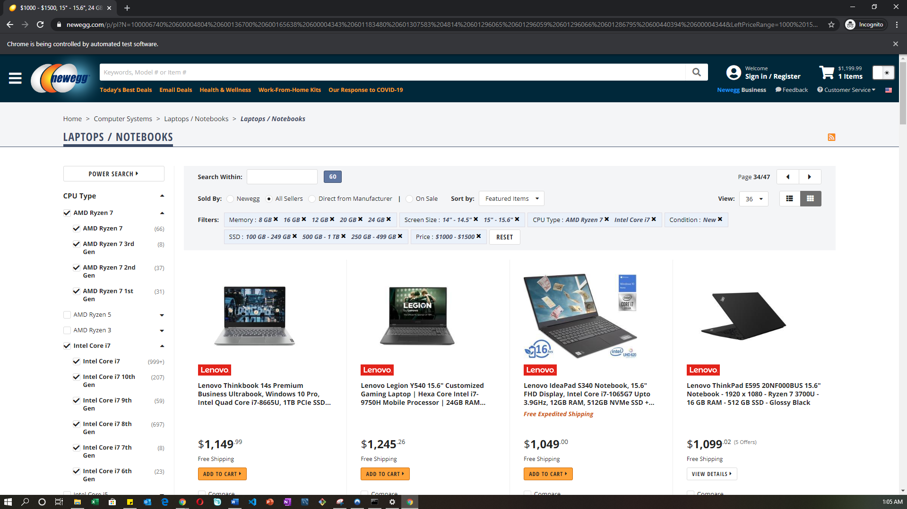

# NewEgg.com WebScraper And Crawler For Laptops

## Scope & Purpose

* For this project, I built a Newegg.com laptop web scraper and page crawler program that succesfully scraped 25 and 47 pages with 900 and 1,692 laptops scraped, which you will find in the final_ouputs folder. Each scarped page are also saved in the processing folder. My objective was to further develop my data extraction skills from the web, the "E" in ETL, and build a robust webscraper to the best of my ability given the limited time I invested into this project, and experience. Data mining skills are essential as a Data Engineer and analyst, so that was where my main focus was for this project.

## Background Information

* My inspiration for this project came from an YouTube video called "Introduction To WebScraping With Python and BeautifulSoup" by Data Science Dojo, and it was instructed and narrated by Phuc Duong (Sr. Data Science Engineer). I will post the link in the credits at the end. Although this video was made 3 years ago, and the Python and BeautifulSoup versions he used was older, Mr. Duong did a great job in explaining the underlying concepts of webscraping with BeautifulSoup. I was able to reproduce the same results after reviewing updated documenation from BeautifulSoup4's website. After achieving initial success of webscraping one page of laptops from Newegg.com, I wanted to further challenge myself by adding a webcrawler capability that automatically clicks next page to as many pages the user inputted search query produces. Thoughout my program, my intention was to implement dyanmic and light object oriented programming concepts.

## Notable Built-in Functions

* NewEgg web scarper functions that will keep trying to scrape the target pages using a while loop, and output a csv file per page; all laptops on a page are passed into a Laptop class, and objects are created using a list comprehension, and are subsequently appended to a list called "product_catalog", producing a "list of list of objects".
* Webcrawler that accurately loops thru pages of the search result; randomly mouses over product links on pages; and randomly sleeps and clicks the top or bottom next page button to emulate human behavior.
* Optional function enabling the user concatenate all scarped pages into one CSV file when scrape is completed.
* Option function to clear out the "processing" folder to prevent clutter.
* Google reCAPTCHA and NewEgg's "Are You Human?" test functions that scans the requested HTML, pauses the program, and alerts the user if Newegg suspects a bot; suggested instructed actions are provided to help the user circumvent Newegg's defenses to be successful in their scrape.

## User Input And Output Expectations

* The only input requirement from the user is a Newegg.com search query results's URL (e.g. going to Newegg.com and check boxes for a lenovo laptops between prices of $1000 - $1500, with Intel Core 7 Processor, 16gb memory, and 250gb SSD and etc... that produces 50 pages) - see example below.

* The three potential outputs:

- 1) One CSV file of all pages scraped in one CSV file in the final_output folder
- 2) Each Scraped page as a seperate CSV file in the processing folder
- 3) Potential Errors in the event the program is unable to circumvent Newegg's reCAPTCHA (Developed by Google) to help protect websites from being webscraped by requiring website visitors to complete image selections tests to prove the user is a human and not a bot. As you can imagine, this was an obstacle I had to figure out a way to overcome, which is why this why I call this a "supervised webscraper and crawler", as the user is prompted to take action to circumvent their defenses.
  
* Important Note: Every time I made an attempt to scrape Newegg, it got harder and harder and they are usually run JavaScript to change up certain div tags and elements in their page to make scraping harder. Overall my code should work for a few pages at least when they don't suspect you are a bot. I also found that scraping late night towards midnight, was when I had the best results. My hypothesis is that their system resets at that time because the odds are, they employ machine learning to predict which users are bots based on all user traffic from that day. This is also why, you'll notice there are many different Xpaths I have set up as Try's and Excepts in my code.

## System Prerequisites To Get Started

You will need the following installed on your computer system, if you want to replicate my analysis:
* Python >= 3.7 and the associated libraries:
* import os
* import re
* import glob
* import time
* import random
* import requests
* import datetime
* import pandas as pd
* from re import search
* from splinter import Browser
* from playsound import playsound
* from bs4 import BeautifulSoup as soup
* Jupyter Notebook - all of the programming reside in these files

## Getting Started - Options

* Viewing Source Code And Produced Results - if this is the route you'd like to go, then please click on the only and conveniently placed Jupyter Notebook in the repository. All of my code and webcrawling and scraping program logs are in the main Jupyter Notebook. I've also saved the results log from my program when I completed a 47 page scrape in the txt file. In the final_ouputs and processing folder, you will see the 25 and 47 page successful scrapes I did with my program.

* Clone / Download Entire Repository - if you'd like to replicate my work, please download / clone my repository and install all of the prerequisites. After, you can open the Jupyter Notebook, use the same search query I did or go to Newegg.com, and produce a search url query yourself.

## Sample Code And Findings

* Welcome to NewEgg.com Supervised Web Crawler and Scraper - please see an example of the introduction to the program and where and how the user will be asked to input the URL to their custom laptop search query.

* After the user input a search query URL, here is a sample of what to expect as when the program is web scraping, and crawling down the page and over to the next.

* Laptops in the yellow square is what the scraper targets every page.

* Examples Of Top And Bottom Next Page Buttons The Web Crawler Randomly Targets Page-To-Page By "Flipping A Coin".

* Note: For the Bottom Next Page Button, I found that NewEgg.com had more of a tendency to change bottom divs when you get deep into the scrape especially, when it suspects the user is a bot, or after the user was prompted to take a Google reCAPTCHA test.

* Programmed "Break Pedals" - the program will pause and user will be alerted when Newegg suspects the user is a bot. After the user takes necessary actions to by pass it, the user is asked to enter in any key to attempt to continue the scrape. Below are examples:

* I wanted to emphasize this nested loop I created below because it was the main key that would unlock treasure chest, where the answer to this project would lie. I created an "Artist" column on the final YouTube Tables joined via Pandas in a dataframe format. I then created this nested loop that would enabled me identify which how many, and which Trending YouTube video belonged to which Spotify Artist. I accomplished this by targeting the artist names (referred to as channel title on YouTube), made them both uniform by removing all spaces, making them lowercase, and had the loop fill in the empty "artist" column if there was a match.
* This Big O notation for time complexity would be an (n*m) function, as it was a nested loop on two seperate arrays. This was substantiated by the signifcant more amount of time I had to wait for this to run, but it was necessary.

* Here are the results we can see all of the artists that were listed on Spotify's Top 100 Songs for 2018, and the respective number of top trending videos they had in 2018. A consideration to keep in mind when viewing the results is because they are music artists, most if not all videos they upload on their channel for viewing is categorized as "Music" (e.g. music videos, promotion, features, video logs, message to fans, and etc).

## Next Steps Considerations
* Can go deeper on analysis, if time permits
* Create nice charts and data visualizations

### Personal Note
* Hope you enjoyed it. Thank you for your time!

## Author

* **Johneson Giang** - *Invidual Project* - [Github](https://github.com/jhustles)

## License

This project is licensed under the MIT License - see the [LICENSE.md](LICENSE.md) file for details

## Acknowledgments
* I definitely want to give a shout out to my dear teacher, mentor, and friend @CodingWithCorgis!